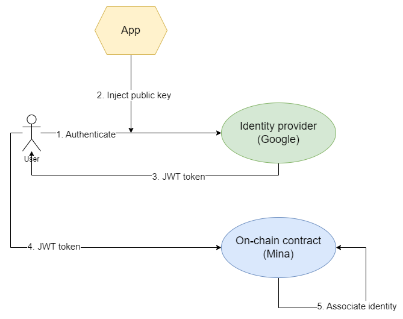

# Identity onramp

This project aims to on-ramp off-chain identities.

This project is loosely based on a non-funded [ZkIgnite proposal](https://zkignite.minaprotocol.com/zkignite/zkapp-cohort-3/finalfundingdecisions/suggestion/703), which in turn is based on [Bonsai Pay](https://www.risczero.com/blog/bonsai-pay) and [zkLogin](https://www.youtube.com/watch?v=FrihpBU4MzY). We mostly leave the asset management things out and focus on the identity.

The project is divided into two phases: the first phase aims to implement the basic functionality, in a PoC style. The second phase adds required ZK privacy and succinctness.

## Basic flow

## Phase 1

The flow goes something like this:

1. User authenticates with their web2 identity provider, such as Google. The authentication flow is just what the user is used to. The only difference is that we embed an on-chain address (public key) into the flow (in the _nonce_ field).
1. User gets a JWT authentication token that has the on-chain address embedded in it.
1. The JWT token is sent on-chain
1. On-chain smart contract verifies its signature (using a stored public key for the identity provider) and associates the web2 identity with the web3 address.

### Issues

Note that this phase implements a very insecure an inefficient version, and can be considered a Proof of Concept.

Mainly it's not a good idea to upload a full functioning identity token to an on-chain contract. And it's not a good idea to upload the full token when only a portion of it is needed in reality.

## Phase 2

This phase aims to bring the project beyond the PoC phase and to make it more realistic to use.

Add ZK proofs to:

1. Add ZK privacy. Instead of uploading the real token, only generate a proof of the needed parts and send the proof.
1. Related to the previous point: generating a proof makes the process also more succinct. Two birds with one stone.
1. Some of the JWT token verification on-chain is expensive. Do some of it off-chain and just prove it.

## Overall recognized issues

There are a few open issues that don't have a good solution thought of, currently.

1. The used tokens are signed by a private key from the identity provider. The identity provider changes their keys, making the old data obsolete. The cycle can be as fast as a week. This means the on-chain verification keys need to be updated as well. How to do this?
1. How to handle timestamps in the tokens. Which time to use and how to handle token expiry.
1. How to handle reuse of old JWT tokens. Maybe we need nullifiers?

## Developer info

For running this locally, you need to do the following setup.

### Serveo

Use serveo.net (instead of ngrok) to establish a tunnel to localhost, for faster development:

1. Create a keypair locally: `ssh-keygen`. I named my key "serveo_key" and stored it in this folder
1. Think of some name for your tunnel (I use "minaidentity"). Change this in the next command
1. If your keypair's name is "serveo_key", login to serveo with `ssh -i ./serveo_key -R minaidentity:80:localhost:3000 serveo.net` and click one of the auth links.
1. Execute the same command again to get a static tunnel name.

### Google Console

1. Login to your Google Console
1. Create a project
1. Go to APIs & Services
1. Create Oauth2 credential. Add your serveo tunnel URL as allowed JavaScript URL and redirect URL
1. Note the ClientID and Client Secret

### Auth0

1. Create a auth0 account
1. Create a new app in Auth0
1. Add your tunnel address to the "application login url" with suffix "/login" and "allowed callback urls" without the suffix.
1. Go to Authentication -> Social
1. Create a Google connection. Enter the Client Secret from Google. No other settings needed

#### Back to Google

Go back to Google Console and add the Auth0 URL with suffix /login/callback to the "Authorized redirect URLs". Something like this: `https://dev-blah.us.auth0.com/login/callback`.

### Local files

Go to login.tsc and modify the REDIRECT_URL to be the tunnel address. After that, login via http://localhost:3000/login with Google should work.
